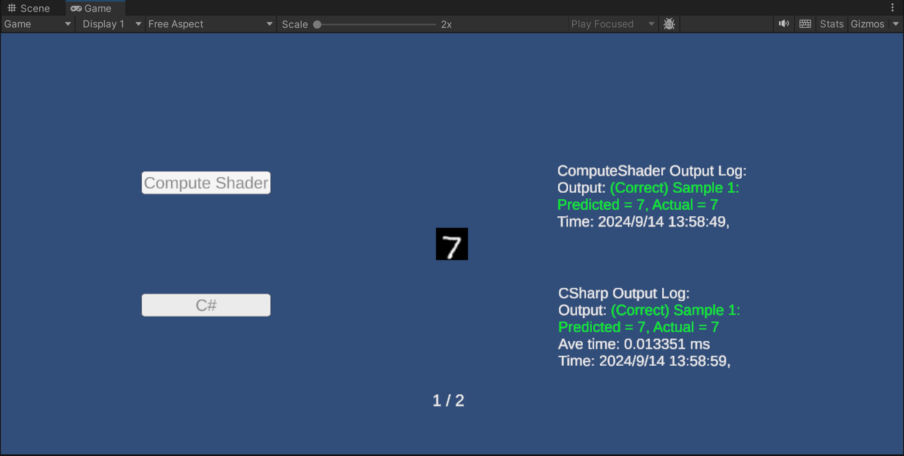

# Unity Binarized Neural Networks (BNN)

Deploying Binary Neural Network (BNNs) AI implementation on Unity using C# and Compute Shader.

For training Binarized Neural Networks and automatically generating C code, please refer to the repository: <https://github.com/ittuann/Binarized-Neural-Networks>

